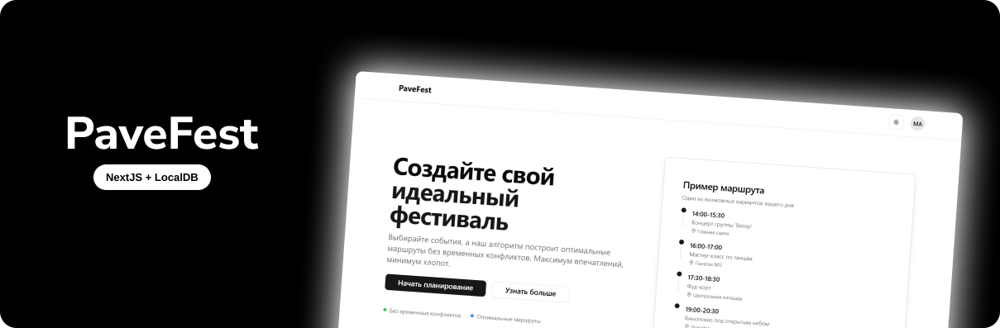

<div align="center">
  <br />
    <a href="https://github.com/magasov" target="_blank">
      
    </a>
  <br />
 
  <p>
    <code></code>
    <code></code>
    <code></code>
  </p>
  <h1 align="center">PaveFest</h1>

   <div align="center">
    Интерактивное веб-приложение для планирования посещения фестиваля: выбирайте события, стройте удобный маршрут на день и следите за своей программой в одном месте.  
Приложение работает полностью в браузере и хранит данные пользователя в `localStorage`, поэтому для демо-запуска не нужен отдельный бэкенд или база данных.
    </div>
</div>


---

## Основные возможности

- 👤 **Аккаунт пользователя**
  - Регистрация и вход (демо-аутентификация через `localStorage`)
  - Профиль с редактированием основных данных
  - Загрузка / ссылка на аватар
  - Экспорт и очистка данных профиля

- 🗓 **Список событий фестиваля**
  - Предзаполненный каталог событий с категориями (музыка, мастер-классы, кино, еда, искусство, спорт)
  - Фильтрация по категориям и поиск по названию
  - Добавление событий в личный планировщик

- 🧭 **Планировщик маршрута**
  - Отображение выбранных событий как маршрута на день
  - Несколько сценариев оптимизации (по времени, по популярности, сбалансированный и т.п.)
  - Подсчёт общей длительности и «рейтингов» маршрута
  - Сохранение плана в `localStorage` для конкретного пользователя

- 🎨 **Современный UI**
  - Светлая/тёмная тема
  - Адаптивная вёрстка (удобно на десктопе и ноутбуке)
  - Компоненты на базе **shadcn/ui** и **Radix UI**

---

## Стек технологий

- **Next.js 14** (App Router)
- **React** + **TypeScript**
- **Tailwind CSS**
- **shadcn/ui** (UI-компоненты на базе Radix)
- **lucide-react** (иконки)
- **react-hot-toast** (уведомления)

---

## Требования

- **Node.js**: версии `>= 18` (LTS)
- **npm** (по умолчанию) или любая другая пакетная система:
  - `npm` / `yarn` / `pnpm`


---

## Установка и запуск

### 1. Клонирование репозитория / распаковка архива

```bash
git clone https://github.com/magasov/codegush
cd codegush
```

Или просто распакуйте архив в папку `codegush/` и перейдите в неё:

```bash
cd codegush
```

### 2. Установка зависимостей

```bash
npm install
# или
yarn
# или
pnpm install
```

### 3. Локальный запуск (режим разработки)

```bash
npm run dev
# или
yarn dev
# или
pnpm dev
```

После запуска приложение будет доступно по адресу:

- http://localhost:3000

При изменении кода страница будет автоматически перезагружаться.

### 4. Production-сборка и запуск

Собрать:

```bash
npm run build
# или
yarn build
# или
pnpm build
```

Запустить production-сервер:

```bash
npm start
# или
yarn start
# или
pnpm start
```

По умолчанию сервер также будет доступен по адресу:

- http://localhost:3000

---

## Структура проекта (упрощённо)

```text
codegush/
├─ app/
│  ├─ page.tsx                # Главная страница
│  ├─ about/page.tsx          # О проекте
│  ├─ events/page.tsx         # Каталог событий
│  ├─ planner/page.tsx        # Планировщик маршрутов
│  ├─ profile/page.tsx        # Профиль пользователя
│  ├─ faq/page.tsx            # FAQ
│  ├─ api/auth-context.tsx    # Контекст аутентификации (localStorage)
│  ├─ layout.tsx              # Общий layout приложения
│  └─ globals.css             # Глобальные стили
│
├─ components/
│  ├─ header.tsx              # Шапка сайта (навигация, аккаунт)
│  ├─ footer.tsx              # Подвал
│  ├─ popup.tsx               # Модальное окно логина/регистрации
│  ├─ theme-provider.tsx      # Провайдер тем
│  ├─ theme-toggle.tsx        # Переключатель светлой/тёмной темы
│  └─ ui/                     # Библиотека UI-компонентов (button, card, input и т.п.)
│
├─ public/
│  ├─ logo.png                # Логотип
│  ├─ next.svg, vercel.svg    # Статические ресурсы по умолчанию
│  └─ ...                     # Здесь можно хранить скриншоты
│
├─ .env                       # Переменные окружения (демо)
├─ package.json               # Скрипты и зависимости
├─ tailwind.config.ts         # Конфигурация Tailwind CSS
└─ tsconfig.json              # Конфигурация TypeScript
```

---

## Как работать с приложением

1. **Открыть главную страницу**  
   Перейдите на `http://localhost:3000`. На главной есть описание сервиса и кнопка перехода к демо.

2. **Создать аккаунт**
   - В шапке нажмите кнопку авторизации (модальное окно).
   - Выберите регистрацию, заполните поля (Имя, Имя пользователя, Email, Пароль).
   - Данные сохраняются в `localStorage` вашего браузера.

3. **Авторизоваться**
   - Переключитесь на режим «Вход».
   - Введите имя пользователя и пароль, которые указали при регистрации.
   - После входа в шапке появится аватар и меню аккаунта.

4. **Выбрать события**
   - Перейдите на страницу **События** (`/events`).
   - Отфильтруйте события по категории или воспользуйтесь поиском.
   - Добавляйте события в планировщик (кнопка добавления/галочка).

5. **Построить маршрут**
   - Перейдите на страницу **Планировщик** (`/planner`).
   - Посмотрите свой текущий маршрут.
   - Переключайте режимы оптимизации (по времени, популярности, балансу и т.д.).
   - Сохранённый план остаётся в браузере до очистки данных.

6. **Управление профилем**
   - На странице **Профиль** (`/profile`) можно:
     - Изменить основные данные (имя, username, email и т.д.).
     - Загрузить аватар.
     - Экспортировать профиль в JSON.
     - Очистить локальные данные.

---

## Примечания

- Проект предназначен как демо: логин/регистрация и данные пользователя **не защищены** и не предназначены для продакшена.
- Все данные хранятся локально в браузере (`localStorage`), отдельного сервера и БД не требуется.
- Для деплоя на любой хостинг, поддерживающий Next.js, достаточно выполнить `npm run build` и затем запустить `npm start` (или настроить адаптированный runtime на выбранной платформе).
